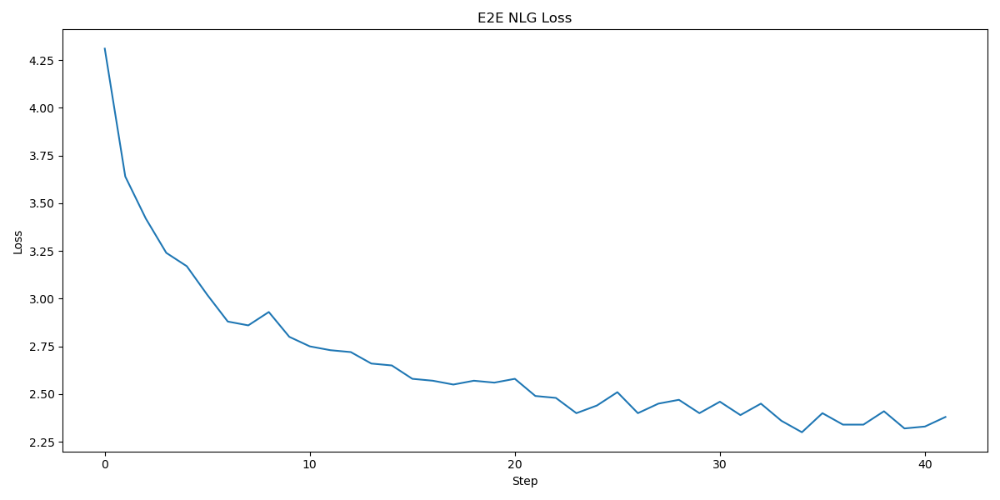
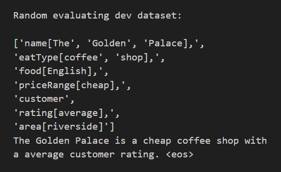
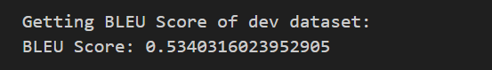
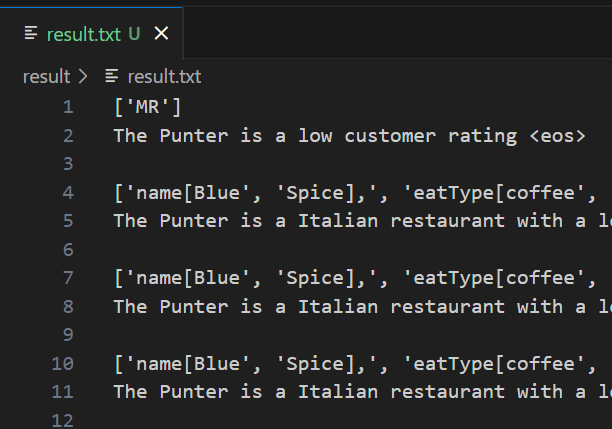

# Seq2seq-Text-Generation
 generate text using seq2seq model

 

## Environment

| 环境 |         环境配置      |
| :--: | -------------------- |
| 镜像 |      PyTorch 1.10.0        Python 3.8(ubuntu20.04)         Cuda 11.3      |
| CPU | 14 vCPU Intel(R) Xeon(R) Gold 6330 CPU @ 2.00GHz |
| GPU  | RTX 3090(24GB) * 1 |

 

## Result

| 操作           | 输出结果                                   | 分析 |
| :-----------: | :---------------------------------------: | ---- |
| 数据分析       |  | 我们针对训练集做出了数据分析，从左图可看出训练集的平均句子长度为21.79，最小长度为1，最大长度为73。 句子长度在50之后逐渐减少，因此我们在数据预处理的部分将训练集、测试集和验证集的src和tgt长度统一设置为50。 |
| 数据预处理     |  |      |
| 模型训练       |  |      |
| 模型训练损失   |               |      |
| 评估验证集     |  |      |
| BLEU分数       |  |      |
| 生成测试集结果 |  |      |

