# Seq2seq-Text-Generation
 generate text using seq2seq model

 

## Dataset

##### 数据集字段统计

| 数据集       | mr/MR | ref    |
| :---------: | :---: | :----: |
| trainset.csv | 4862  | 42061  |
| devset.csv   | 547   | 4672   |
| testset.csv  | 630   | ------ |

 

##### 数据集结构

| Dataset |                          数据集结构                          |
| :-----: | :----------------------------------------------------------: |
| 训练集  | 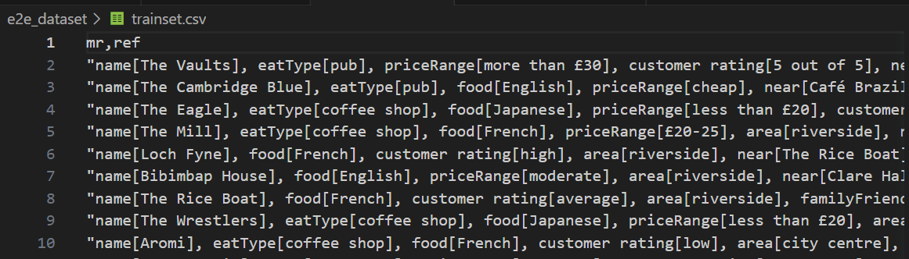 |
| 验证集  | 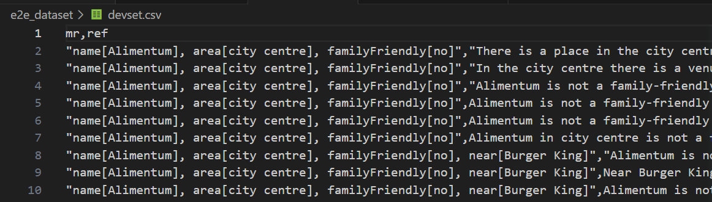 |
| 测试集  | 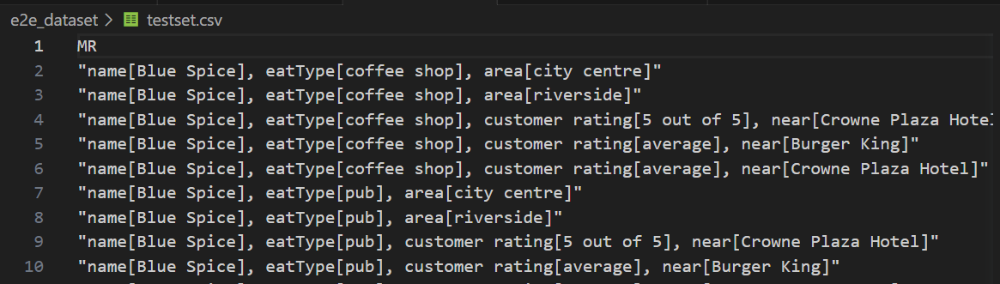 |

 

## Environment

| 环境 |         环境配置      |
| :--: | -------------------- |
| 镜像 |      PyTorch 1.10.0 + Python 3.8 (Ubuntu 20.04) + Cuda 11.3      |
| CPU | 14 vCPU Intel(R) Xeon(R) Gold 6330 CPU @ 2.00GHz |
| GPU  | RTX 3090(24GB) * 1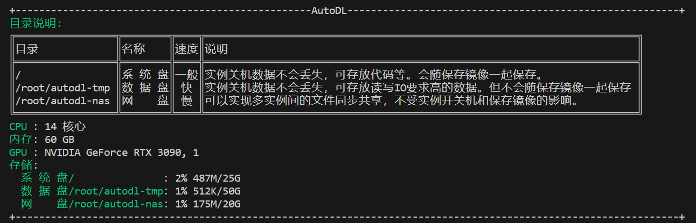 |

 

## Code

| 操作     | 代码                                                         |
| :--------: | :------------------------------------------------------------: |
| 模块导入 |  |
| 常量定义 | 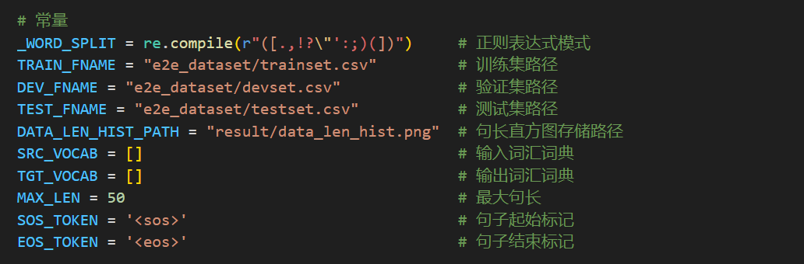 |
|          |  |
|          |                                                              |

 

## Result

| 操作           | 输出结果                                   | 分析 |
| :-----------: | :---------------------------------------: | ---- |
| 数据分析       | 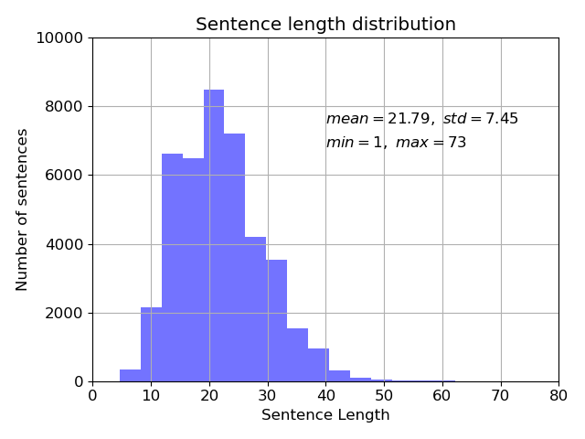 | 我们针对训练集做出了数据分析，从左图可看出训练集的平均句子长度为 21.79，最小长度为 1，最大长度为 73。  句子长度在50之后逐渐减少，因此我们在数据预处理的部分将训练集、测试集和验证集的 src 和 tgt 长度统一设置为 50。 |
| 模型训练损失 | 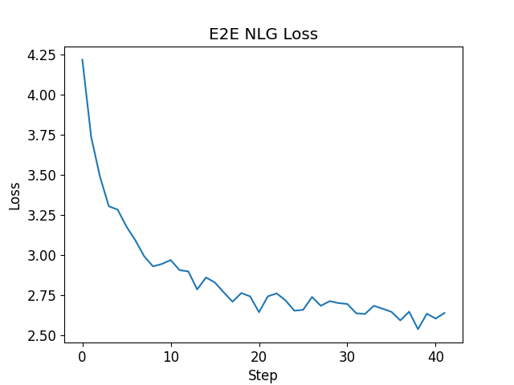 | 从左图的训练集损失图像我们可观测到，模型在经过迭代训练的过程中，模型损失逐步递减。 |
| 数据预处理     | 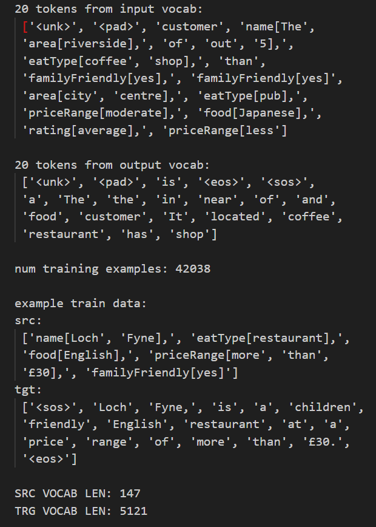 |      |
| 模型训练       | 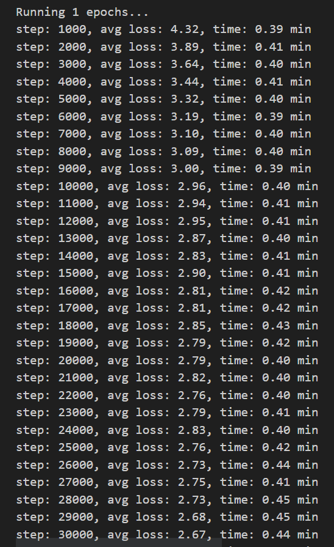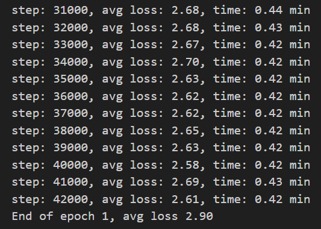 |      |
|              |                                                              |      |

 

| 评估操作             | 截图                                                         |
| :--------------------: | :------------------------------------------------------------: |
| 评估验证集 | 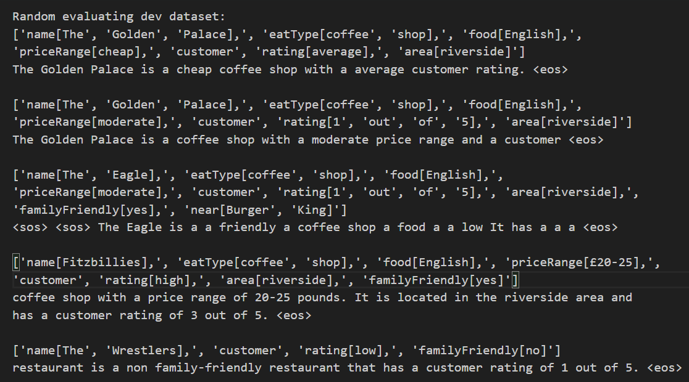 |
| 评估测试集并保存结果 | 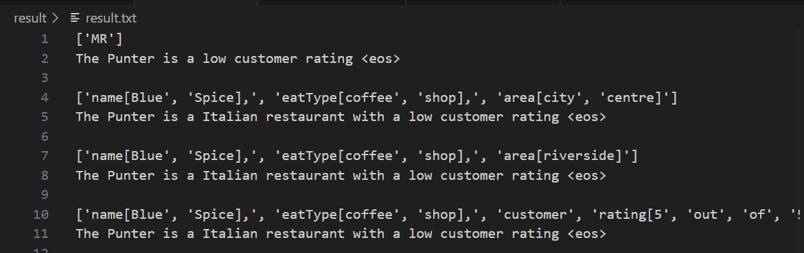 |
| 验证集上的BLEU分数 | 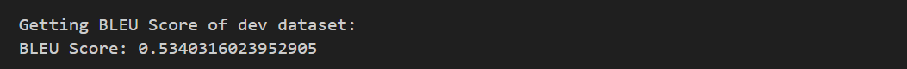 |

